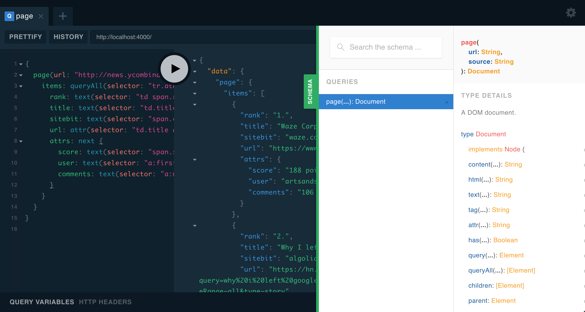

# graphql-scraper-server

Instantly set up a [`graphql-scraper`](https://github.com/lachenmayer/graphql-scraper) server for all of your web scraping needs.

This is a super-simple module which simply ties together [`graphql-scraper`](https://github.com/lachenmayer/graphql-scraper) and [`graphql-yoga`](https://github.com/graphcool/graphql-yoga).

## 1-click deploy

[](https://deploy.now.sh/?repo=https://github.com/lachenmayer/graphql-scraper-server)

[](https://heroku.com/deploy?template=https://github.com/lachenmayer/graphql-scraper-server)

## local install

```bash
git clone https://github.com/lachenmayer/graphql-scraper-server
yarn # or npm install
yarn start # or npm start
```

## ok great, what now?

Point your browser to wherever you deployed the server, and you will see a [graphql-playground](https://npmjs.com/package/graphql-playground).



You can use this to send queries to your brand new server, or to explore the [`graphql-scraper`](https://github.com/lachenmayer/graphql-scraper) schema documentation interactively.

You can also send GraphQL queries to the server (the query endpoint is also at `/`) using your favourite GraphQL client.

If you can't think of a good query to try out, try this one:

```graphql
{
  page(url: "http://news.ycombinator.com") {
    items: queryAll(selector: "tr.athing") {
      rank: text(selector: "td span.rank")
      title: text(selector: "td.title a")
      sitebit: text(selector: "span.comhead a")
      url: attr(selector: "td.title a", name: "href")
      attrs: next {
        score: text(selector: "span.score")
        user: text(selector: "a:first-of-type")
        comments: text(selector: "a:nth-of-type(3)")
      }
    }
  }
}
```